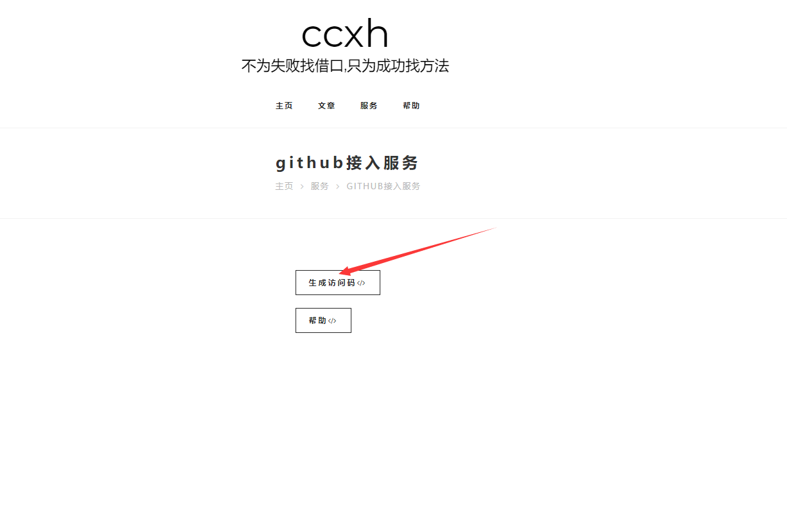
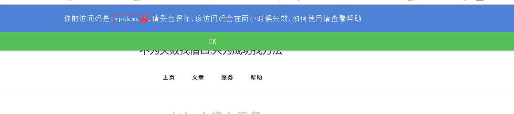
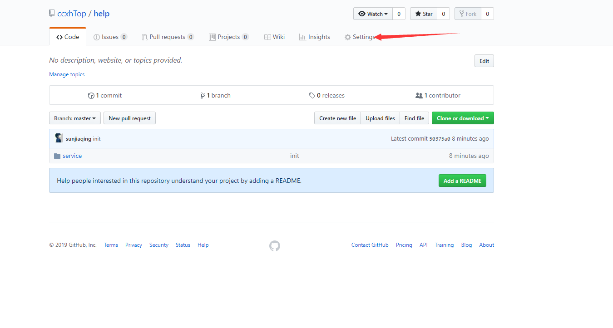
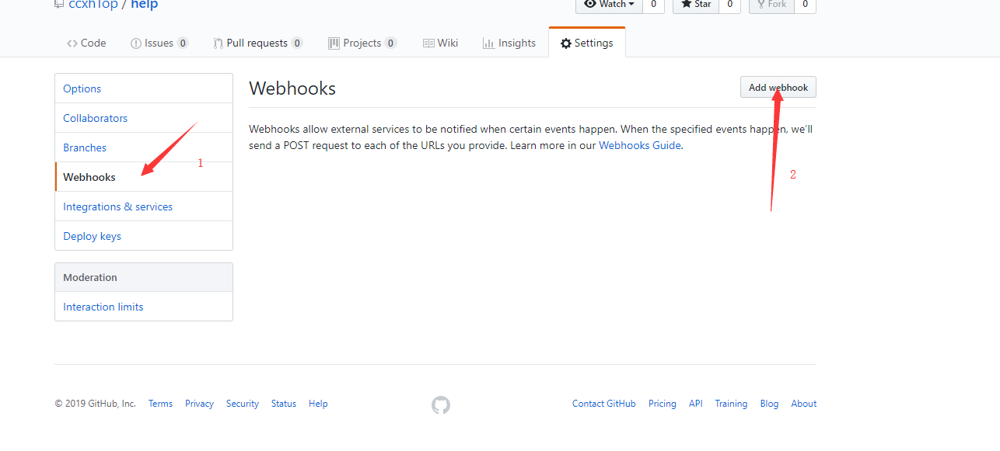
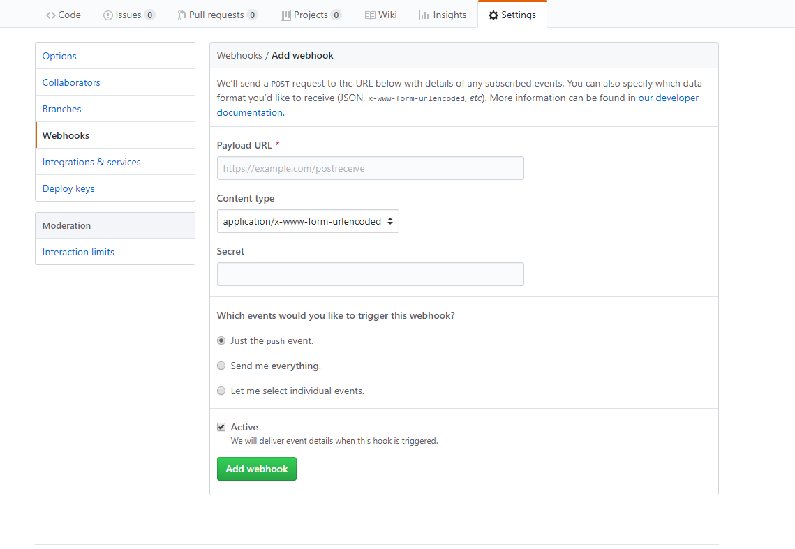

# github接入

## 步骤

1. 访问此页面 
    - [生成access访问码](http://39.105.183.116/debian/service-github.html)
2. 点击生成
    - 
3. 复制你的访问码
    - 
4. 打开你需要接入的仓库页面,点击`settings`
    - 
5. 添加`webhoos`
    - 
6. 编辑webhooks的表单
    - 
    - Payload URL
      - 填写 `http://39.105.183.116/api/hooks/`+你的访问码
    - Content type
      - 填写 `application/json`
    - Secret
      - 随意 
    - Which events would you like to trigger this webhook?
      - 选择`Just the push event.`
7. 点击添加

8. 等待数秒查看网页即可

> 访问码用于确认属于你的唯一仓库